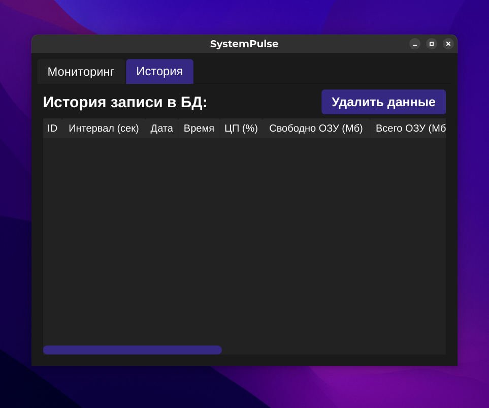
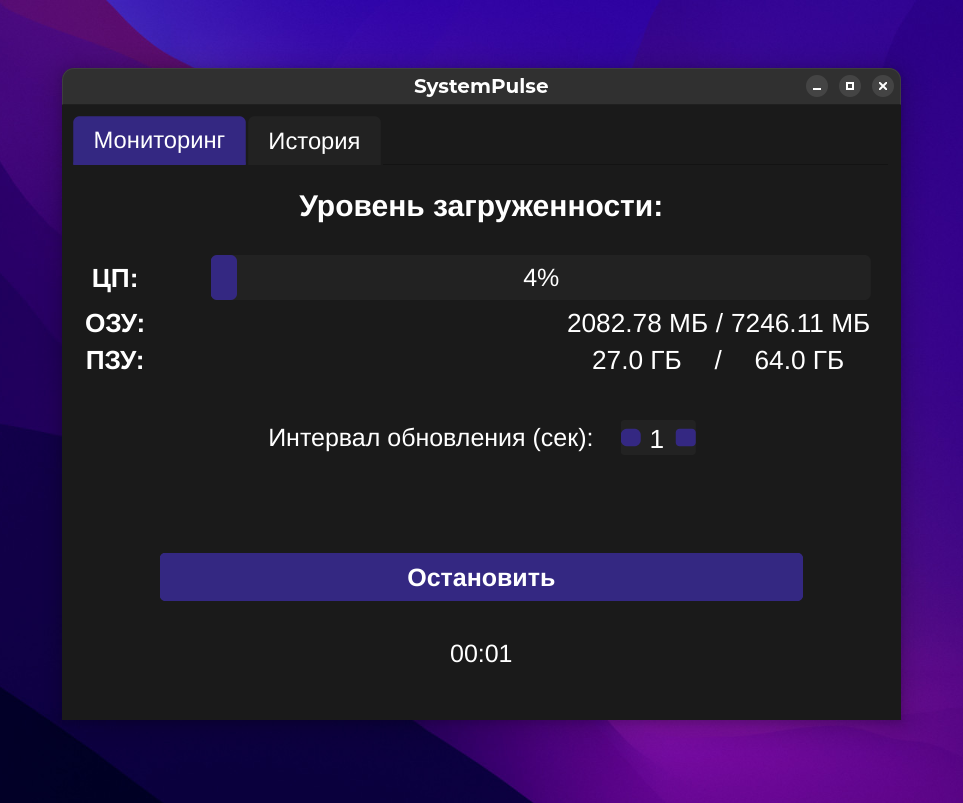
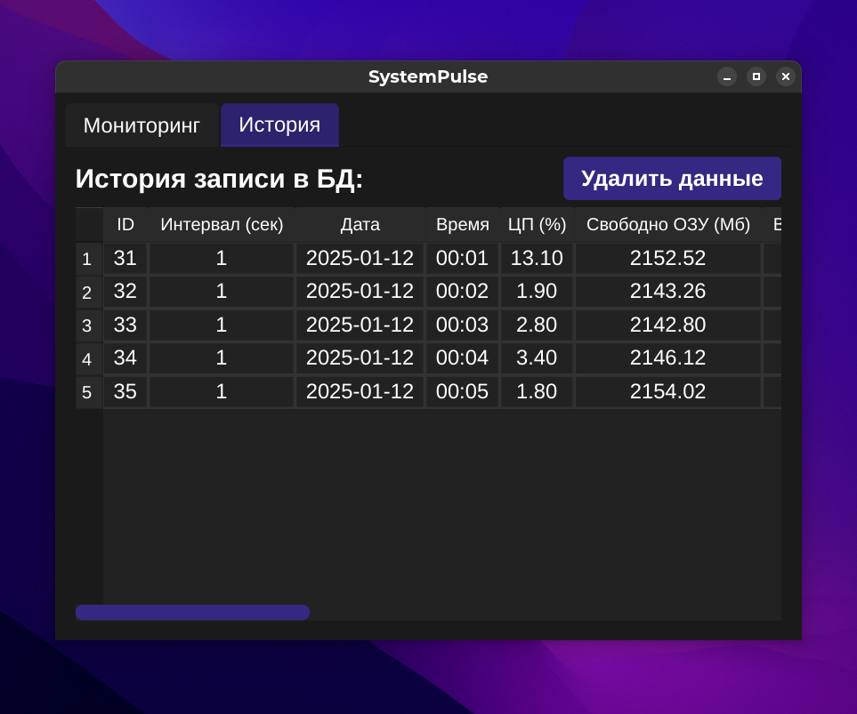
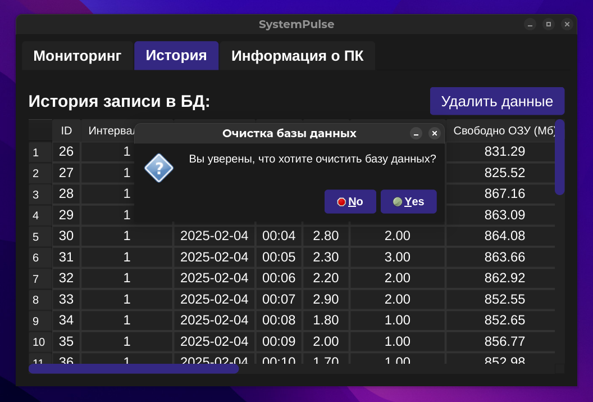
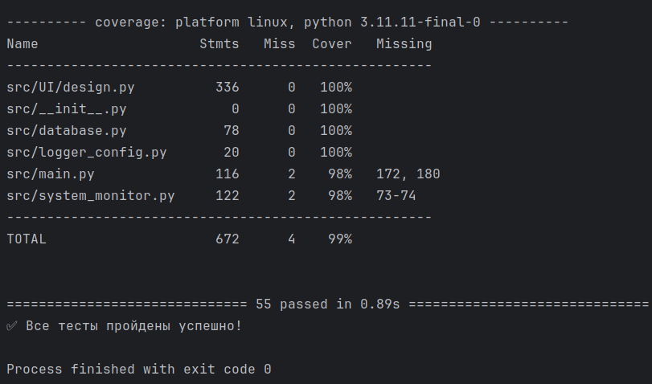

# Система мониторинга системных ресурсов

## 🖥️ Описание проекта

Приложение для мониторинга системных ресурсов с графическим интерфейсом, позволяющее отслеживать загрузку процессора, использование памяти, сетевую активность и другие параметры системы.

## 🌟 Особенности

- Графический интерфейс на PySide6
- Real-time мониторинг системных ресурсов
- Логирование системных событий
- База данных, где храниться весь проведённый мониторинг

## 🛠️ Технологический стек

- Python 3.10+
- PySide6
- psutil
- pydf
- SQLite
- pytest

## 📋 Требования к системе

- Python 3.10 или выше
- ОС: Windows 10+, macOS 10.15+, Linux (Ubuntu 20.04+)
- Минимум 4 ГБ оперативной памяти
- 200 МБ свободного дискового пространства

## 🚀 Установка

### Клонирование репозитория

```bash
git clone https://github.com/[ваш_username]/system-monitor.git
cd system-monitor
```

### Создание виртуального окружения

```bash
python3 -m venv venv
source venv/bin/activate  # Для Unix/macOS
# или
venv\Scripts\activate     # Для Windows
```

### Установка зависимостей

```bash
pip install -r requirements.txt
```

## 🎮 Запуск приложения

```bash
python main.py
```

## 🧪 Запуск тестов

```bash
python -m tests.run_tests
```

## 📸 Скриншоты приложения и результатов тестирования

### Главные экраны приложения




### Запуск мониторинга




### Удаление записей из базы


### Результаты тестирования 


## 🛡️ GitHub Actions

### Статус тестов
